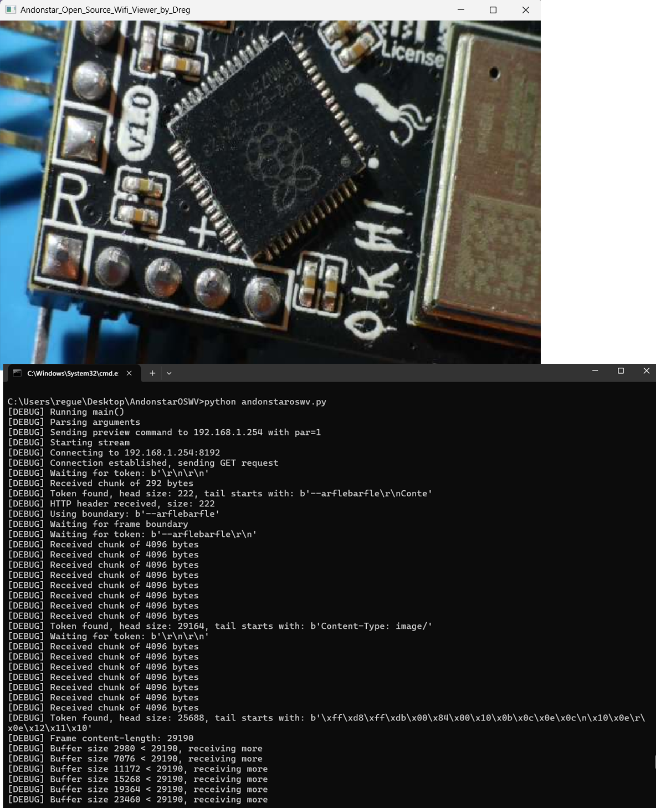
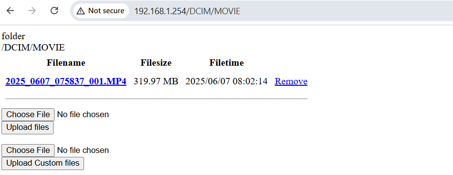

# Andonstar Wi-Fi Microscope Viewer for PC
*A research + reversing + tool born from **20 minutes of late-night** -*

Streaming the microscope live feed to your PC over Wi-Fi gives you a larger display while still keeping the microscope’s built-in screen available for quick checks.

I've added a script to the repository for both **Linux** (`no_python_windows_script_vlc_curl.sh`) and **Windows** (`no_python_windows_script_vlc_curl.bat`) that works **without Python**. All you need is **CURL** and **VLC** installed, no additional setup required.

Note: I'm a lazy bastard when it comes to these things, and ChatGPT is my slave, so don't be surprised if there's something silly written here or in the code. It's late, and I'm tired.



---

## ✨ What is it?

My Andonstar AD409-Max Wi-Fi microscope stream live video as **multipart-MJPEG** on **TCP 8192** once you flip a **MAGIC** **REST** switch.  

This repo contains one self-contained Python script that:

1. sends the preview-on command (`cmd=3001`),  
2. opens the 8192 socket,  
3. parses MJPEG boundaries,  
4. shows the frames with **OpenCV**,  
5. (optional) writes every JPEG to disk,  
6. turns preview off when you quit.  

No vendor app, no browser, no adb, just Python.

NOTE: I am not sure if this works with other Andonstar. I created this for my AD409-Max, and it works. This was a quick and basic research effort. If you have a different model, feel free to try it and let me know if it works.

---

## Why?

This script makes that possible by relaying the MJPEG stream to your computer and toggling the onboard preview. Note that on the AD409-Max model, the HDMI output is disabled whenever the internal display is active—you can’t use both outputs at the same time. 

So this is the easy way to have two displays at same time: one for the microscope and one for your computer.

## 🚀 Quick start

- Enable WI-FI on your ANDONSTAR microscope from the **Settings** menu 
- Connect your computer to the microscope's Wi-Fi network
- SSID should be something like `Andonstar-AD409-XXXX` or `Andonstar-AD407-XXXX`
- Password is usually `12345678` or `1234567890`

### Dependencies

| package           | why                       |
|-------------------|---------------------------|
| `requests`        | send the REST toggle      |
| `opencv-python`   | decode MJPEG & display    |
| `numpy`           | buffer → array bridge     |

Install everything:

```bash
pip install requests opencv-python numpy
```

---

Then run the script:
```bash
python andonstaroswv.py                           # resizable window
python andonstaroswv.py --fullscreen              # full-screen
python andonstaroswv.py --save shots              # dump JPEGs to ./shots
```

Press **Esc** or hit **Ctrl-C** to exit.

---

## CLI

| option             | default          | description                      |
|--------------------|------------------|----------------------------------|
| `ip`               | `192.168.1.254` | microscope address               |
| `--fullscreen`     | off              | border-less full-screen window   |
| `--save <DIR>`     | –                | store raw JPEGs in *DIR*         |

---

## How does it work?

| step | what happens                                                      |
|------|------------------------------------------------------------------|
| 1    | `GET /?custom=1&cmd=3001&par=1` → preview **ON**, port **8192 OPEN** |
| 2    | send `GET / HTTP/1.1` to 8192                                     |
| 3    | camera returns `multipart/x-mixed-replace; boundary=…`            |
| 4    | script slices JPEG blocks → `cv2.imdecode` → `cv2.imshow`         |
| 5    | `cmd=3001&par=0` on exit                                          |

---

## SHELL commands

```bash
curl "http://192.168.1.254/?custom=1&cmd=3001&par=1"   # preview ON
vlc  http://192.168.1.254:8192/                        # or ffplay …
curl "http://192.168.1.254/?custom=1&cmd=3001&par=0"   # preview OFF
```

---

## Files for fellow reverse‑engineers

* **`net.pcapng`** – raw Android APK Wi‑Fi trace  
* **`Ucam_1.9.4.02.apk`** – original Android APK  
* **`Ucam_1.9.4.02_decomp.zip`** – Jadx output  

Dig in, craft new commands, port the code—go wild.

```
PORT      STATE  SERVICE
554/tcp   closed rtsp
8080/tcp  closed http-proxy
10900/udp closed unknown
20000/udp closed dnp
MAC Address: 98:03:CF:26:D3:FC (Shenzhen Bilian Electroni...)
``` 

After **MAGIC** REST switch, the device opens port **8192** for MJPEG streaming:

```
PORT     STATE SERVICE
80/tcp   open  http
443/tcp  open  https
3333/tcp open  dec-notes
8192/tcp open  sophos
MAC Address: 98:03:CF:26:D3:FC (Shenzhen Bilian Electroni...)
```

Btw, **3029** cmd returns the current Wi-Fi SSID and password:

```
curl "http://192.168.1.254/?custom=1&cmd=3029"
```

```
<?xml version="1.0" encoding="UTF-8" ?>
<LIST>
<SSID>Andonstar-9803cf26d3fc</SSID>
<PASSPHRASE>12345678</PASSPHRASE>
</LIST>
``` 

---

## Download Images & Videos via WIFI WEB

http://192.168.1.254/



---

## TO-DO

- [ ] Investigate why the Wi-Fi disconnects after some time. It might require sending a keep-alive command, implementing a sleep mechanism, or exploring other potential solutions. use `powershell -ExecutionPolicy Bypass -File .\wifi_force.ps1` as a crap-workaround.
- [ ] research & document all commands
- [ ] check if **preview off** command works 
- [ ] test more Andonstar models
- [ ] add more features to python script like mp4 **recording** 

## Tested

- Dreg's AD409-Max

